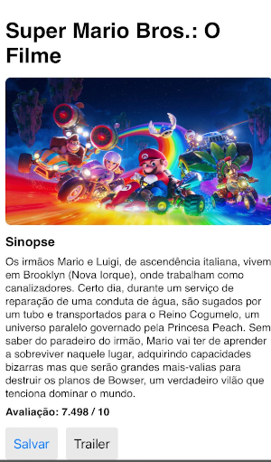
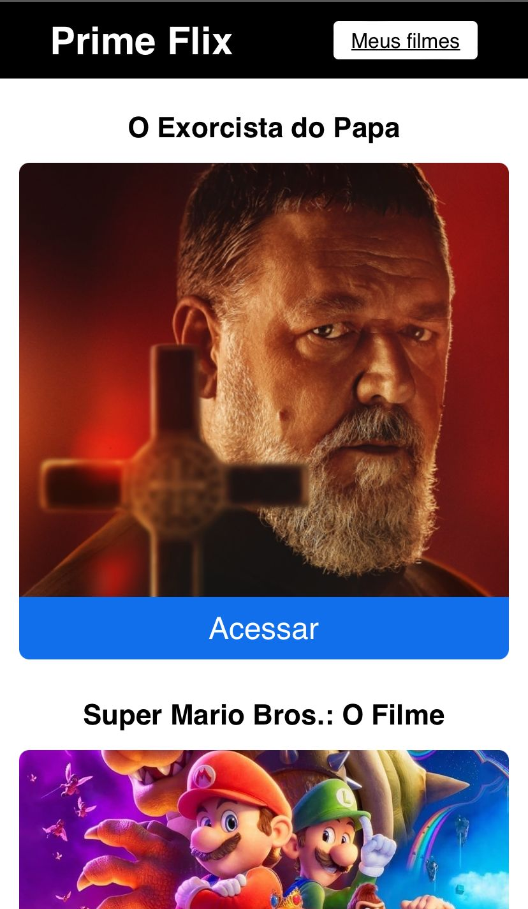
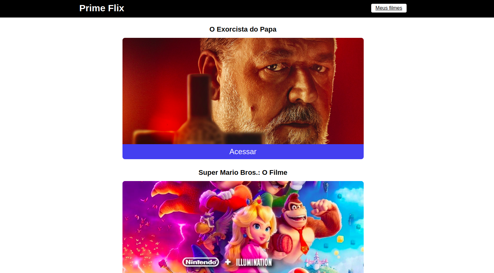
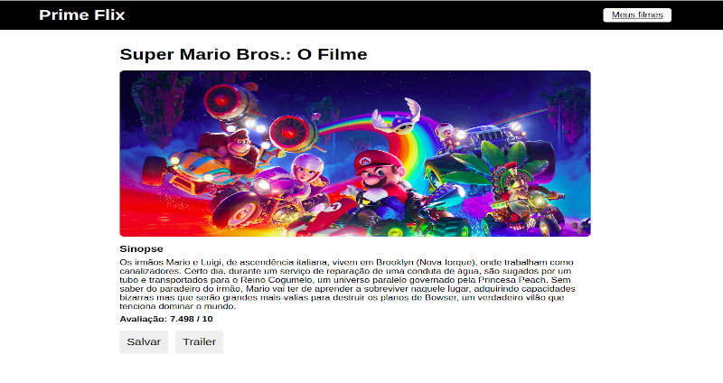

# prime-flix-filmes
 https://prime-rho.vercel.app/
## Getting Started with Create React App
This project was bootstrapped with [Create React App](https://github.com/facebook/create-react-app).

## Available Scripts
In the project directory, you can run:
## `npm start`
Runs the app in the development mode.\
Open [http://localhost:3000](http://localhost:3000) to view it in your browser.

# Sobre o projeto

A aplicação "Prime-Flix-Filmes" utiliza uma API externa para buscar informações sobre os filmes em cartaz no momento. A aplicação exibe detalhes do filme, como imagem de cartaz, 
informações relevantes e trailer do filme obtido do Youtube. É possível adicionar filmes aos favoritos, editá-los e visualizar mais detalhes.

## Layout mobile
 

## Layout web

# Tecnologias utilizadas

## Front end
- HTML 
- SCSS 
- JS 
- Next-JS

# Autor

Guilherme Gomes

https://www.linkedin.com/in/guilherme-gomes-427321238/

